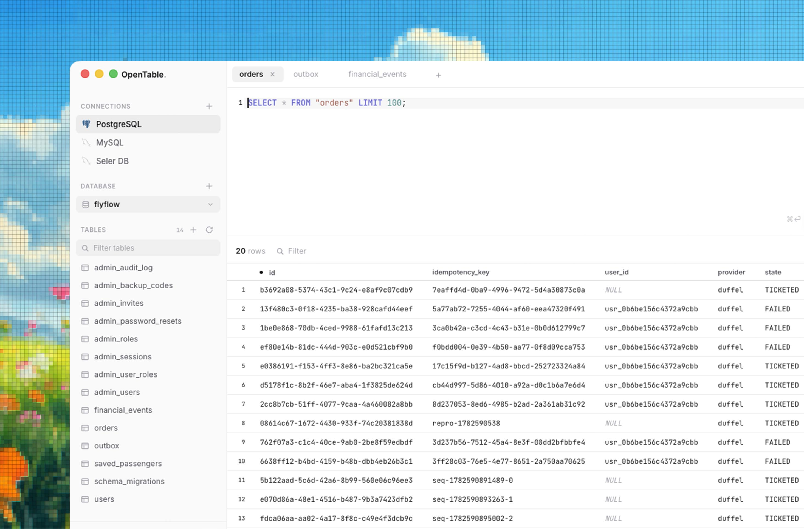

<div align="center">


# OpenTable

**A clean, fast SQL editor for the desktop.**
PostgreSQL, MySQL/MariaDB and SQLite — locally or through an SSH tunnel.

[](https://github.com/mohammedkmo/opentable/actions/workflows/ci.yml)
[](LICENSE)

<br />



</div>

---

OpenTable is a database client that gets out of the way. An editor-first
interface, a keyboard-driven command palette, and a results grid that stays
responsive on a hundred thousand rows. Free, open source, and yours to modify.

## Features

**Connect**
- PostgreSQL, MySQL/MariaDB, and SQLite — SQLite needs no server, just a file
- SSH tunnels via ssh-agent, a private key, or a password, with your
  `~/.ssh/config` hosts offered in a dropdown
- Paste a `postgres://` or `mysql://` URL and the whole form fills itself
- Passwords encrypted with the OS keychain, never written in plain text
- Mark a connection `local`, `staging` or `production`

**Query**
- Schema-aware autocomplete — real tables and columns from your database
- Run the selection, or just the statement under the cursor — <kbd>⌘⏎</kbd>
- **Cancel a running query** — a runaway `SELECT` never locks the connection
- Multi-statement scripts, each result rendered separately
- Query history, saved queries, and a <kbd>⌘K</kbd> palette over everything

**Read**
- Virtualised grid — only visible rows are in the DOM, so large results scroll
  smoothly
- Sort, filter, and a default `LIMIT` guard so a huge table can't freeze the app
- Export CSV, JSON, SQL inserts or Markdown

**Edit**
- Double-click a cell to edit; `Tab` across, `Enter` commits
- All changes apply in **one transaction** using **bound parameters**
- Offered only when the result maps to a single table with a primary key

**Design your schema**
- Create tables in a visual builder with live SQL, including foreign keys
- **Interactive schema map** — explore real foreign-key relationships, search
  tables and columns, pan/zoom the graph, and jump straight to data or structure
- Click a relationship to inspect its columns and referential actions, then copy
  a ready-to-run `JOIN` or export the whole model as Mermaid ERD text
- **Alter existing tables** — add, rename, retype and drop columns, change the
  primary key, add and drop indexes and foreign keys
- Every change previewed as exact SQL before it runs

**AI** *(optional — bring your own key, or run a model locally)*
- Ask in plain English; the answer is written straight into the editor
- Explain a query, or fix one that errored
- **Chat with your database** — a conversation that runs its own read-only
  queries to answer questions about real data, not just the schema
- Your schema is sent as context so it uses real column names
- Works with Anthropic, or any OpenAI-compatible endpoint: **Ollama** and
  **LM Studio** locally, or vLLM, OpenRouter, Groq and NVIDIA NIM remotely

### Chat, and what it is allowed to do

Chat can run queries itself so it can answer from your data rather than
guessing. What it may run on its own is decided by an **allowlist**, not a
blocklist, because the SQL is model-generated:

- A single, plainly read-only `SELECT` runs immediately.
- **Everything else stops and asks you**, showing the exact SQL first.

"Everything else" is broader than it sounds, and deliberately so. These all
require your approval even though they look like reads:

| Statement | Why it asks |
| --- | --- |
| `WITH x AS (DELETE … RETURNING *) SELECT * FROM x` | a write that starts with `WITH` |
| `SELECT * INTO new_table FROM t` | creates a table on Postgres |
| `SELECT … INTO OUTFILE '/tmp/x'` | writes a file on MySQL |
| `SELECT * FROM t FOR UPDATE` | takes row locks |
| `SELECT pg_sleep(9999)` | ties up the connection |
| `SELECT 1; DROP TABLE t` | more than one statement |

Nothing is permanently forbidden — you can approve anything you could have
typed yourself. Every query it ran stays visible in the conversation, so the
whole chain is auditable after the fact.

**Where your schema goes.** The prompt includes a sketch of your tables and
columns. With Anthropic that reaches Anthropic; with a local Ollama or LM
Studio endpoint it never leaves your machine. That choice is yours in
Settings, and it is the reason the provider is configurable.

**Safety**
- Confirmation before `UPDATE`/`DELETE` without a `WHERE`, and before any write
  on a production connection
- Destructive schema changes itemised in plain English first
- Production connections marked in red

## Install

Download the latest build from [Releases](https://github.com/mohammedkmo/opentable/releases).

| Platform | File |
| --- | --- |
| macOS (Apple Silicon / Intel) | `.dmg` |
| Windows | `.exe` installer |
| Linux | `.AppImage` or `.deb` |

The app updates itself: it checks on launch and every few hours, downloads in
the background, and installs when you next quit. You can also check manually in
**Settings**.

## Develop

```bash
git clone https://github.com/mohammedkmo/opentable.git
cd opentable
npm install
npm run dev
```

Requires Node 22 or newer.

```bash
npm run typecheck     # both main and renderer
npm run build         # production bundle
npm run dist:mac      # or dist:win / dist:linux
```

## Architecture

```
src/
  main/         Node side — drivers, SSH, files, secrets
    db.ts       connections, cancellation, introspection, transactional edits
    schemaGraph.ts  cross-dialect foreign-key graph introspection
    store.ts    encrypted connections, history, saved queries, settings
    ai.ts       Claude API calls, grounded in your schema
    updater.ts  auto-update lifecycle
  preload/      the only bridge: a typed, explicit IPC surface
  renderer/     React UI, no Node access
  shared/       types and pure SQL builders used by both sides
    sql.ts      identifier quoting, CREATE TABLE / INDEX builders
    alter.ts    diffs a table into the right ALTER statements per dialect
```

The renderer runs with `contextIsolation: true` and `nodeIntegration: false`.
Every database call crosses the preload bridge as a named method.

### Notes for contributors

Three dialect quirks are worth knowing before touching SQL generation:

- **MySQL silently ignores inline `REFERENCES`.** Foreign keys are emitted as
  table-level constraints so they work everywhere.
- **SQLite cannot alter a column type, nullability, default, primary key or
  foreign keys.** Those route through a full table rebuild that copies the rows
  across inside a transaction.
- **Postgres runs DDL transactionally**, so a failed multi-statement `ALTER`
  rolls back entirely. MySQL commits each statement, so failures report how far
  they got.

See [CONTRIBUTING.md](CONTRIBUTING.md) for more.

## Releasing

Tag a commit and CI builds all three platforms:

```bash
npm version minor && git push --follow-tags
```

The build uploads into a **draft** release. Drafts are invisible to users and
ignored by the updater, so check every installer is present, then press
**Publish release** to ship it.

⚠️ **macOS builds must be code signed to auto-update.** An unsigned build can
detect a new version but can never install it — Squirrel refuses to replace an
app it cannot verify. See [docs/RELEASING.md](docs/RELEASING.md) for the
certificate setup.

## Built with

Electron · React · TypeScript · CodeMirror 6 · `pg` · `mysql2` · `node:sqlite`
· `ssh2` · electron-vite · electron-builder

Fonts: Inter for the interface, JetBrains Mono for SQL and data.

## Licence

[MIT](LICENSE) © Mohammed K
